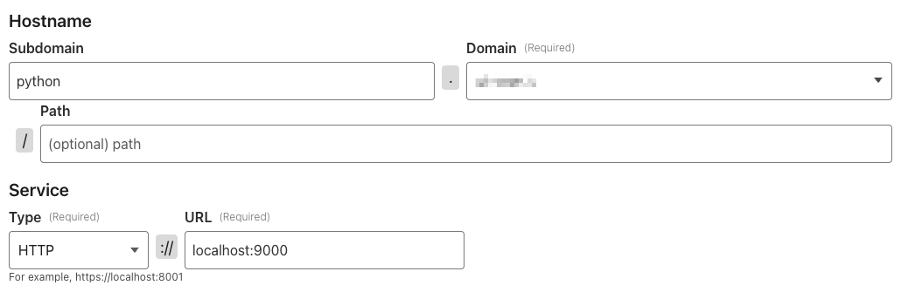

# ❄️ Stay Frosty

**Cloudflare tunnel setup + SSH hardening + full VPS lockdown.**

So you got a shiny new VPS and you don't want to get pwned? Want to install services and have them available to the internet?

This script may be a good start.

One liner for Ubuntu / Debian:
```bash
wget -O stayfrosty.sh https://raw.githubusercontent.com/TheRoccoB/cloudflared-vps-lockdown/master/stayfrosty.sh && chmod +x stayfrosty.sh && ./stayfrosty.sh
```

This script:
* Helps you configure Cloudflare tunnels to access your server via a URL like ssh.mydomain.com.
* Works on Ubuntu and Debian
* Is tested on Digital Ocean and Hetzner Cloud. 
* It should work elsewhere, but make sure to check your security afterwards. The script gives you helpful nmap commands to run to do your own verification.

After Cloudflare SSH tunneling is set up, you're prompted to proceed with the following:
* UFW to block all direct ports to the server.
* Allowlists direct SSH access for IP's that you select, like your (home, office, etc)
* Installs fail2ban (prevents SSH brute force attacks)
* Enables automatic security updates.
* Tells you how to run nmap to scan your server for open ports.

**Feedback welcomed in case I missed something.** 

## Prerequisites

* Free cloudflare account with a custom domain attached.
* A new VPS instance (DigitalOcean Droplet, Hetzner Cloud, etc).
* Cloudflared not installed.
* You can log in from your local box `ssh root@<server-ip>` with SSH keys (not password).

## Existing Setups
The script should be safe to run on an existing setup without Cloudflared installed. It will prompt before closing down UFW ports and modifying SSH.

## Running from Local

Assumption:

Install from a local box, allowing your home IP direct SSH access as a fallback. Fill in `SERVER_IP`: 
```
SERVER_IP=
HOME_IP=$(curl -s -4 https://ifconfig.co || curl -s -6 https://ifconfig.co)

rsync -avz ./stayfrosty.sh root@$SERVER_IP:/root/
ssh -t root@$SERVER_IP "chmod +x /root/stayfrosty.sh && /root/stayfrosty.sh $HOME_IP"
```

You can leave home IP blank if you don't want fallback direct SSH access.

## Running from Remote
```
wget -O stayfrosty.sh https://raw.githubusercontent.com/TheRoccoB/cloudflared-vps-lockdown/master/stayfrosty.sh
chmod +x stayfrosty.sh
./stayfrosty.sh
```

## What next?

Well, you can use this tunnel now for multiple services!

Just run a service on localhost, select your tunnel, public hostnames => add a URL and port mapping.



Super simple python server:
```
echo '<!doctype html><html><body><h1>Hello, World!</h1></body></html>' > index.html
python3 -m http.server 9000
```

Typically, you would run services with docker.

You can also look into Cloudflare access to further tighten SSH'ing into your account and to block access to admin pages.

## Gotcha's

Docker likes to sometimes bypass UFW firewall with ip_tables or something. Run the following commands to check your server anytime you fire up a new service:

```
# top 1000 ports
nmap -Pn <server-ip> 

# all ports (slow)
nmap -Pn -p- <server-ip>
```

## 🧊 Stay frosty.
